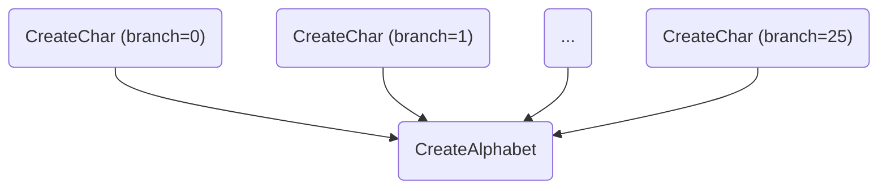

# Law workflows with CMS Crab (and HTCondor) at CERN

This example demonstrates how to create law task workflows that can submit jobs to both CMS Crab and the HTCondor batch system at CERN.

The actual payload of the tasks is rather trivial.
The workflow consists of 26 tasks (`CreateChars`) which convert an integer between 97 and 122 (ascii) into a character.
A single task (`CreateAlphabet`) collects the results in the end and writes all characters into a text file.



Resources: [luigi](http://luigi.readthedocs.io/en/stable), [law](http://law.readthedocs.io/en/latest)


## 1. Clone this example repository

Do not forget the ``--recursive`` option as `law` is currently integrated as a submdoule.

```shell
$ git clone --recursive git@github.com:riga/law_example_CMSCrabWorkflows.git

# or via https (discouraged)
# git clone --recursive https://github.com/riga/law_example_CMSCrabWorkflows.git

$ cd law_example_CMSCrabWorkflows
```


## 2. Source the setup script

This sets up the software environment (a minimal virtual env / venv) when sourced for the first time, and configures a handful of environment variables.

```shell
$ source setup.sh
```


## 3. Fill your storage information

In this example, we will store output files at different locations:

- `CreateChars`, by default, writes to your CERNBox directory (/eos/user/..., see [`[wlcg_fs]` in law.cfg](./law.cfg))
- `CreateAlphabet` writes into a local directory at `data/store/CreateAlphabet/...`.

However, we will use Crab jobs below which require two additional settings.
They are only needed for the Crab submission to work but have **no effect** otherwise.

Therefore, please adjust the `crab.storage_element` setting in [law.cfg](./law.cfg)❗️
The value of `crab.base_directory` should work just fine.

```ini
[crab]

storage_element: T2_DE_DESY
base_directory: /store/user/$GRID_USER/law_CMSCrabWorkflow_outputs
```

**Note** that `GRID_USER` is inferred dynamically on lxplus.


## 4. Let law index your tasks and their parameters

The following commands quickly scans the tasks in the repository and saves their names and parameters in a temporary file that is used for fast auto completion of the `law run` command line tool in the next step.

```shell
$ law index --verbose

indexing tasks in 1 module(s)
loading module 'analysis.tasks', done

module 'law.contrib.cms.tasks', 1 task(s):
    - law.cms.BundleCMSSW

module 'law.contrib.git', 1 task(s):
    - law.git.BundleGitRepository

module 'analysis.framework', 2 task(s):
    - BundleRepo
    - BundleSoftware

module 'analysis.tasks', 2 task(s):
    - CreateChars
    - CreateAlphabet

written 2 task(s) to index file '/law_example_CMSCrabWorkflows/.law/index'
```


## 5. Run a single `CreateChars` task

`CreateChars` is a workflow which - when invoked without a `--branch NUM` parameter - will potentially handle the submission of jobs to ran all its branch branches.
The actual implementation of this mechanism depends on which `--workflow TYPE` is selected.

In this example, the types `local`, `crab` and `htcondor` are supported.
But for this first first test, let's execute a single task with `--branch 0`, i.e., the first branch task leading to the character "a".

```shell
$ law run CreateChars --version v1 --branch 0
```

You will see an output similar to

```shell
INFO: luigi-interface - Informed scheduler that task   CreateChars_0__False_ccefadfd95   has status   PENDING
INFO: luigi-interface - Done scheduling tasks
INFO: luigi-interface - Running Worker with 1 processes
INFO: luigi-interface - [pid 10805] Worker Worker(...) running   CreateChars(effective_workflow=local, branch=0, version=v1)
INFO: luigi-interface - [pid 10805] Worker Worker(...) done      CreateChars(effective_workflow=local, branch=0, version=v1)
INFO: luigi-interface - Informed scheduler that task   CreateChars_0__False_ccefadfd95   has status   DONE
INFO: luigi-interface - Worker Worker(...) was stopped. Shutting down Keep-Alive thread
INFO: luigi-interface -
===== Luigi Execution Summary =====

Scheduled 1 tasks of which:
* 1 ran successfully:
    - 1 CreateChars(...)

This progress looks :) because there were no failed tasks or missing dependencies

===== Luigi Execution Summary =====
```

which means that the task execution was successful.
To verify that, run the **same command as above**, but add `--print-status 0` which does not re-run the task, but print its status.
The `0` refers to the recursion depth through task requirements and since a single `CreateChars` branch has no requirements on its own, `0` is a sensible value here.

```shell
$ law run CreateChar --version v1 --branch 0 --print-status 0

print task status with max_depth 0 and target_depth 0

0 > CreateChars(effective_workflow=local, branch=0, version=v1)
      WLCGFileTarget(fs=wlcg_fs, path=/CreateChars/v1/output_0.json)
        existent
```

The output exists now!
**Note** that the output target is a `WLCGFileTarget` with its `fs` set to `wlcg_fs`.
Have a look into the [law.cfg](./law.cfg) to see what `wlcg_fs` is referring to.
Alternatively, add `--print-output 0` to the command instead of `--print-status 0` to see the exact output file locations.


## 6. Check the status of the `CreateAlphabet` task

Now we add `--print-status -1` to the `CreateAlphabet` task which in turn also shows the status of **all** requirements at any depth (`-1`).

```shell
$ law run CreateAlphabet --version v1 --print-status -1

print task status with max_depth -1 and target_depth 0

0 > CreateAlphabet(version=v1)
│     LocalFileTarget(fs=local_fs, path=$STORE_PATH/CreateAlphabet/v1/alphabet.txt)
│       absent
│
└──1 > CreateChars(effective_workflow=local, branch=-1, version=v1, workflow=local)
         collection: TargetCollection(len=26, threshold=26.0)
           absent (1/26)
```

The output of `CreateAlphabet` is missing as expected, but for `CreateChars` we see that one out of 26 possible outputs exists due to the previous step.
**Note** that `CreateChars` has the parameter `branch=-1` here, which means that it is a workflow wrapping all its 26 branch tasks.
Therefore, its output is not a single file but a *collection* of all outputs of its branches.


## 7. Run everything, everywhere, all at once

Now, we trigger all tasks to run on either Crab or HTCondor jobs.
The **important bit** is that it does not matter *where* jobs are run, as long as they produce the same output in the desired location.
In this sense, both Crab and HTCondor can be considered methods for *transporting* the task execution to remote locations.

*Run everything* and *all at once* mean that we do not trigger `CreateChars` tasks manually, but `CreateAlphabet` instead and let the requirement resolution handle things.

Regarding *everywhere*, you decide where jobs should be transferred to: choose either `--workflow crab` or `--workflow htcondor`.
Also, have a look into the [task implementation](./analysis/tasks.py), especially into how the `CreateChars` task is configured to run either on Crab or HTCondor.
You will see that this is done in a **single line** (checkout which classes `CreateChars` inherits from).

Run the following command (assuming Crab now).

```shell
$ law run CreateAlphabet \
    --version v1 \
    --CreateChars-poll-interval 30sec \
    --CreateChar-workflow crab \
    --print-status -1
```

Usually, all parameters are forwarded to the task that is actually triggered, `CreateAlphabet` in this case.
However, it is also possible to pass parameters to any upstream task by prepending the task name to the parameter name, e.g. `--CreateChar-workflow crab` above.

```shell
print task status with max_depth -1 and target_depth 0

0 > CreateAlphabet(version=v1)
│     LocalFileTarget(fs=local_fs, path=$STORE_PATH/CreateAlphabet/v1/alphabet.txt)
│       absent
│
└──1 > CreateChars(effective_workflow=crab, branch=-1, version=v1, workflow=crab)
   │     jobs: LocalFileTarget(fs=local_fs, path=$STORE_PATH/CreateChars/v1/crab_jobs_0To26.json, optional)
   │       absent
   │     collection: TargetCollection(len=26, threshold=26.0)
   │       absent (1/26)
   │
   ├──2 > BundleRepo(include_files=, custom_checksum=NO_STR, source_path=NO_STR, replicas=5)
   │        SiblingFileCollection(len=5, threshold=1.0, fs=wlcg_fs, dir=/BundleRepo)
   │          absent (0/5)
   │
   └──2 > BundleSoftware(source_path=NO_STR, replicas=5)
            SiblingFileCollection(len=5, threshold=1.0, fs=wlcg_fs, dir=/BundleSoftware)
              absent (0/5)
```

Since `CreateChars` would submit crab jobs now, it has two new requirements: `BundleRepo` and `BundleSoftware`.
These tasks bundle the example repository as well as the virtual env created in `setup.sh` and provide them for Crab jobs.
A very similar mechanism is in place for normal Crab submissions to provide a bundled CMSSW checkout (this is not needed here though).

Now, remove the `--print-status` parameter and **run the tasks** ❗️.

```shell
$ law run CreateAlphabet \
    --version v1 \
    --CreateChars-poll-interval 30sec \
    --CreateChar-workflow crab
```

After the bundle tasks are done you will see the message `submitted 25 crab job(s)` (we ran one task manually above), followed by the output of the job status polling which looks like the following.

```shell
tracking url: https://monit-grafana.cern.ch/d/cmsTMDetail/cms-task-monitoring-task-view?orgId=11&var-user=mrieger&var-task=230823_092720%3Amrieger_crab_CreateChars__1__False_9c890ba92d_fea08c84&from=1692779240000&to=now
11:27:43: all: 26, pending: 25 (+25), running: 0 (+0), finished: 1 (+1), retry: 0 (+0), failed: 0 (+0)
11:28:06: all: 26, pending: 25 (+0), running: 0 (+0), finished: 1 (+0), retry: 0 (+0), failed: 0 (+0)
first log file: https://cmsweb.cern.ch:8443/scheddmon/0194/mrieger/230823_092720:mrieger_crab_CreateChars__1__False_9c890ba92d_fea08c84/job_out.1.0.txt
11:28:30: all: 26, pending: 0 (-25), running: 25 (+25), finished: 1 (+0), retry: 0 (+0), failed: 0 (+0)

...

11:36:12: all: 26, pending: 0 (-2), running: 25 (+2), finished: 1 (+0), retry: 0 (+0), failed: 0 (+0)
11:36:35: all: 26, pending: 0 (+0), running: 25 (+0), finished: 1 (+0), retry: 0 (+0), failed: 0 (+0)

...

11:36:35: all: 26, pending: 0 (+0), running: 0 (-25), finished: 26 (+25), retry: 0 (+0), failed: 0 (+0)
```

This should take a few minutes to process, depending on the job queue.
After a while, when all jobs are done, the `CreateAlphabet` task is started and you should see:

```shell
INFO: luigi-interface - [pid 25835] Worker Worker(...) running   CreateAlphabet(version=v1)

built alphabet: abcdefghijklmnopqrstuvwxyz

INFO: luigi-interface - [pid 25835] Worker Worker(...) done      CreateAlphabet(version=v1)
```


## 8. Check the status again

```shell
$ law run CreateAlphabet \
    --version v1 \
    --CreateChar-workflow crab \
    --print-status -1
```

When step 7 succeeded, all output targets should exist:

```shell
print task status with max_depth -1 and target_depth 0

0 > CreateAlphabet(version=v1)
│     LocalFileTarget(fs=local_fs, path=$STORE_PATH/CreateAlphabet/v1/alphabet.txt)
│       existent
│
└──1 > CreateChars(effective_workflow=crab, branch=-1, version=v1, workflow=crab)
   │     jobs: LocalFileTarget(fs=local_fs, path=$STORE_PATH/CreateChars/v1/crab_jobs_0To26.json, optional)
   │       existent
   │     collection: TargetCollection(len=26, threshold=26.0)
   │       existent (26/26)
   │
   ├──2 > BundleRepo(include_files=, custom_checksum=NO_STR, source_path=NO_STR, replicas=5)
   │        SiblingFileCollection(len=5, threshold=1.0, fs=wlcg_fs, dir=/BundleRepo)
   │          existent (5/5)
   │
   └──2 > BundleSoftware(source_path=NO_STR, replicas=5)
            SiblingFileCollection(len=5, threshold=1.0, fs=wlcg_fs, dir=/BundleSoftware)
              existent (5/5)
```
